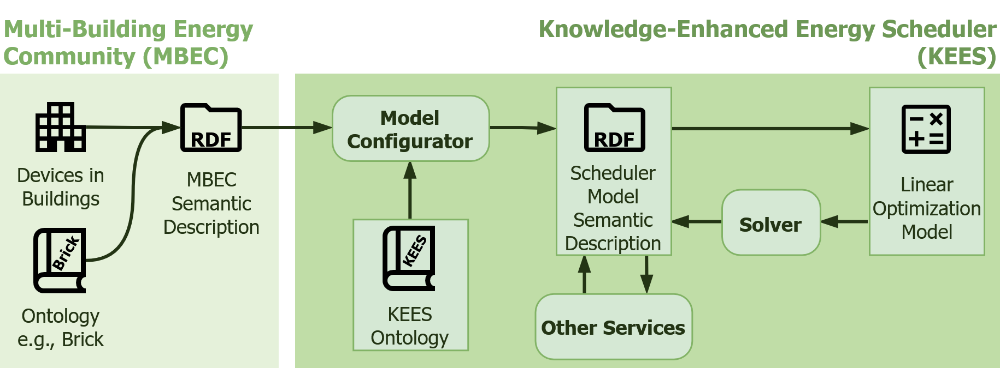

# Knowledge-Enhanced Configuration of Energy Scheduling Models in Multi-Building Energy Communities

Code for reproducing the main results and experiments reported
in [the paper](https://energy.acm.org/eir/knowledge-enhanced-configuration-of-energy-scheduling-models-in-multi-building-energy-communities/)
presented at the 15th DACH+ Conference on
Energy Informatics, Linz, Austria, September 22nd, 2026.

## Abstract


The growing deployment of distributed energy resources in buildings has introduced new challenges in managing building
energy systems. Modern buildings often integrate diverse devices, such as photovoltaic panels, heat pumps, and storage
units, across multiple energy vectors. To efficiently optimize the operation of these interconnected systems, an energy
scheduler service is often implemented. However, the configuration of such a service requires extensive knowledge about
modeled building systems. The paper presents the architecture of a replicable and interoperable energy scheduling
solution. The main contributions are two novel methods for automating energy scheduler model configuration and an
ontology for formal energy scheduler model description. The first configuration approach is based on predefined rules to
extract relevant information from the semantic descriptions of devices installed in buildings. In the experiments, it is
demonstrated that this approach can correctly configure up to 62 % of device parameters, resulting in the representation
of 77 % of devices installed in buildings (69 % of the devices have all parameters correctly configured). The second
configuration approach does not require the manual creation of the rules and relies on large language models to process
semantic descriptions or natural language descriptions of buildings and corresponding devices. It can identify up to
60 % of device parameters correctly, representing 90 % of devices. However, only up to 37 % of the devices are fully
configured without missing or incorrect properties. The results of the configuration services are expressed according to
the proposed ontology, which is designed to represent all concepts relevant to energy scheduling. This allows for
integration with the existing systems and other energy management services.

---

## Working with the Project

> [!NOTE]
> This repository provides an improved version of the code used for the original experiments, with refinements for
clarity, efficiency, and reproducibility.

### 1. Setting up the Environment

The project requires Python 3.13 and uses [`uv`](https://docs.astral.sh/uv/) for dependency and environment management.
You can create the environment according to the project definition using the following command:

```commandline
uv sync
```

### 2. Generating OWL files based on LinkML schemas

For the simplification and better integration with Python code, ontologies are formulated as LinkML schemas located in [
`linkml_schemas`](linkml_schemas). Generated ontology files are already included in the [`ontologies`](ontologies)
directory. To regenerate their Turtle representations, use the following commands:

```commandline
uv run gen-owl linkml_schemas/kees.yaml --no-use-native-uris > ontologies/kees.owl.ttl
uv run gen-owl linkml_schemas/kees_lite.yaml --no-use-native-uris > ontologies/kees_lite.owl.ttl
uv run gen-owl linkml_schemas/brick_lite.yaml --no-use-native-uris > ontologies/brick_lite.owl.ttl
uv run gen-owl linkml_schemas/s4bldg_lite.yaml --no-use-native-uris > ontologies/s4bldg_lite.owl.ttl
```

On Windows (PowerShell), make sure the encoding is UTF-8:

```commandline
uv run gen-owl linkml_schemas/kees.yaml --no-use-native-uris | Out-File ontologies/kees.owl.ttl -Encoding UTF8
uv run gen-owl linkml_schemas/kees_lite.yaml --no-use-native-uris | Out-File ontologies/kees_lite.owl.ttl -Encoding UTF8
uv run gen-owl linkml_schemas/brick_lite.yaml --no-use-native-uris | Out-File ontologies/brick_lite.owl.ttl -Encoding UTF8
uv run gen-owl linkml_schemas/s4bldg_lite.yaml --no-use-native-uris | Out-File ontologies/s4bldg_lite.owl.ttl -Encoding UTF8
``` 

### 3. Scenario Generation

Use scenario generation script ([`src/generate_scenarios.py`](src/generate_scenarios.py) or command
`generate-scenarios`) to create several scenario descriptions (`yaml`, natural language text description, and OWL
semantic descriptions) of buildings and devices installed in them. When experiment name is provided using `--experiment`
or `-e`, scenarios are saved to `output/<experiment_name>_scenarios/<config-name>`.

```commandline
uv run generate-scenarios -e paper_experiments -c configs/paper_scenarios/small_mix.yaml -n 5
uv run generate-scenarios -e paper_experiments -c configs/paper_scenarios/small_per_bldg.yaml -n 5
uv run generate-scenarios -e paper_experiments -c configs/paper_scenarios/small_shared.yaml -n 5
uv run generate-scenarios -e paper_experiments -c configs/paper_scenarios/large_mix.yaml -n 5
uv run generate-scenarios -e paper_experiments -c configs/paper_scenarios/large_per_bldg.yaml -n 5
uv run generate-scenarios -e paper_experiments -c configs/paper_scenarios/large_shared.yaml -n 5
```

### 4. KEES Graph Generation using Rule-Based Configurator

To generate KEES graphs based on the predefined rules for ontologies use [`src/apply_rules.py`](src/apply_rules.py)
script or command `apply-rules`. When experiment name is provided ( `--experiment` or `-e`) without `--input`, all
scenario sets in `output/<experiment>_scenarios` are processed. Default logs are saved under `logs/<experiment>/rules`
and named after each scenario set.

```commandline
uv run apply-rules -e paper_experiments -c configs/rules_config.yaml
```

### 5. KEES Graph Generation using LLM-Based Configurator

To generate KEES graphs based on the created scenarios use [`src/apply_llm.py`](src/apply_llm.py) script or command
`apply-llm`. When experiment name is provided ( `--experiment` or `-e`) without `--input`, all scenario sets in
`output/<experiment_name>_scenarios` are processed. Default logs are saved under `logs/<experiment_name>/llm` and named
after the LLM config and scenario set.

```commandline
uv run apply-llm -e paper_experiments -c configs/llm/ministral3_cloud.yaml
uv run apply-llm -e paper_experiments -c configs/llm/gpt-oss_cloud.yaml
```

The provided LLM configurations use [Ollama](https://ollama.com/) and require the Ollama application in addition to the
Python package installed by `uv`. Install Ollama by following its [official installation
instructions](https://docs.ollama.com/quickstart), ensure the Ollama service is running, and sign in to use the
configured
cloud models:

```commandline
ollama signin
ollama pull ministral-3:14b-cloud
ollama pull gpt-oss:120b-cloud
```

To use another model provider, create a provider-specific class that inherits from the abstract
[`LLMGraphConfigurator`](src/configurator/graph_configurators/llm.py), implement its response retrieval method, and add
the provider to the selection logic in `LLMGraphConfigurator.configure_graph`.

### 6. KEES Graph Evaluation

To count number of represented devices, infrastructures, and properties in KEES graphs generated by different methods
use [`src/evaluate_results.py`](src/evaluate_results.py) script
or command `evaluate-results`. When experiment name is provided ( `--experiment` or `-e`) without `--input`, all
scenario sets in `output/<experiment_name>_scenarios` are evaluated. Results are saved to the evaluation results folder
at `evaluation/<experiment_name>/<scenario-set>.csv`. Default logs are saved under `logs/<experiment_name>/evaluation`
and named after each scenario set.

```commandline
uv run evaluate-results -e paper_experiments -c configs/evaluation_config.yaml
```

## Project Structure

- [`configs`](configs) - `yaml` files with parameters used for scenario generation, model configuration, and evaluation;
- [`linkml_schemas`](linkml_schemas) - directory with [linkml](https://linkml.io/linkml/intro/overview.html) schemas:
    - [`brick_lite.yaml`](linkml_schemas/brick_lite.yaml) - recreation of [Brick ontology](https://brickschema.org/)
      with minimal set of classes and properties required for the experiments;
    - [`kees.yaml`](linkml_schemas/kees.yaml) - full KEES ontology representation, as described in the paper;
    - [`kees_lite.yaml`](linkml_schemas/kees_lite.yaml) - simplified KEES ontology with minimal set of classes and
      properties required for the experiments;
    - [`s4bldg_lite.yaml`](linkml_schemas/s4bldg_lite.yaml) - recreation
      of [SAREF4BLDG ontology](https://saref.etsi.org/saref4bldg/v2.1.1/)
      with minimal set of classes and properties required for the experiments.
- [`notebooks/evaluation_visualization.ipynb`](notebooks/evaluation_visualization.ipynb) - results analysis and
  visualization code;
- [`ontologies`](ontologies) - OWL ontology files in Turtle TTL format (generated from files located in
  `linkml_schemas`):
    - [`brick_lite.owl.ttl`](ontologies/brick_lite.owl.ttl) - recreation of [Brick ontology](https://brickschema.org/)
      with minimal set of classes and properties required for the experiments;
    - [`kees.owl.ttl`](ontologies/kees.owl.ttl) - full KEES ontology representation, as described in the paper;
    - [`kees_lite.owl.ttl`](ontologies/kees_lite.owl.ttl) - simplified KEES ontology with minimal set of classes and
      properties required for the experiments;
    - [`s4bldg_lite.owl.ttl`](ontologies/s4bldg_lite.owl.ttl) - recreation
      of [SAREF4BLDG ontology](https://saref.etsi.org/saref4bldg/v2.1.1/)
      with minimal set of classes and properties required for the experiments.
- [`src`](src) - code source files.

## Citation

```
@article{gagin2026a,
    author = {Gagin, Stepan and de Meer, Hermann},
    title = {Knowledge-Enhanced Configuration of Energy Scheduling Models in Multi-Building Energy Communities},
    year = {2026},
    issue_date = {September 2026},
    publisher = {Association for Computing Machinery},
    address = {New York, NY, USA},
    volume = {6},
    number = {3},
    journal = {SIGENERGY Energy Informatics Review},
    month = September,
    numpages = {15},
    url = {https://energy.acm.org/eir/knowledge-enhanced-configuration-of-energy-scheduling-models-in-multi-building-energy-communities/},
}
```
